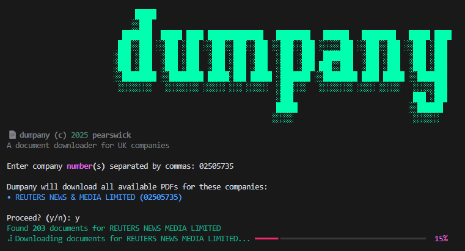

# 📄 dumpany

This tool helps you download all available PDF documents for a target company from Companies House, the UK's official company registry. It creates a 'dump' of company documents on your computer for you to browse offline, or upload to other tools like [Google's NotebookLM](https://notebooklm.google.com/).



## How it Works

When you run dumpany it:
1. Asks you to enter a company number (you can enter more than one company number, just use a comma to separate them)
2. Uses the Companies House API to fetch metadata for all documents for target compan(ies)
3. Creates a 'dump' folder on your computer
4. Creates a folder named after each company within the 'dump' folder
5. Downloads all available PDF documents for every company

## File Naming

dumpany uses the Company House API to fetch metadata for each document, and then names the documents accordingly:
- Date first (YYYY-MM-DD)
- Then the company name
- Then what type of document it is

For example:
2024-03-15_ACME_LIMITED_annual_accounts.pdf
2024-02-01_ACME_LIMITED_confirmation_statement.pdf


**Note:**
Older documents use a legacy file naming system at Companies House. dumpany will use an alternative bit of the metadata to handle these files but, due to the way Companies House data was previously organised, you may see some weird file names.

## Setup

### Getting an API Key

1. Register for a Companies House account at [developer.company-information.service.gov.uk](https://developer.company-information.service.gov.uk/get-started/)
2. Create an application and get your API key
3. Make sure to mark your application as "live" (not "test") to access real company data

### Installation

1. Clone this repository:
   ```bash
   git clone https://github.com/dumpany/dumpany.git
   cd dumpany
   ```

2. Create a virtual environment (recommended):
   ```bash
   python -m venv venv
   ```

3. Activate the virtual environment:
   - On Windows:
     ```bash
     venv\Scripts\activate
     ```
   - On macOS/Linux:
     ```bash
     source venv/bin/activate
     ```

4. Install required packages:
   ```bash
   pip install -r requirements.txt
   ```

5. Create a `.env` file with your API key and place this in your dumpany directory:
   ```
   API_KEY=your_api_key_here
   DUMP_DIR=dump
   ```

### Requirements

1. Python 3.8 or higher
2. Companies House API key
3. The required Python packages (installed via requirements.txt)

## Environment Variables

Create a `.env` file with:
- `API_KEY`: Your Companies House API key (from the setup steps above)
- `DUMP_DIR`: Where you want the documents saved (defaults to 'dump')

## Usage

1. Make sure your virtual environment is activated
2. Run the script:
   ```bash
   python dumpany.py
   ```
3. Enter the company number when prompted
4. Documents will be downloaded to the dump directory